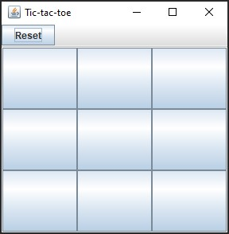
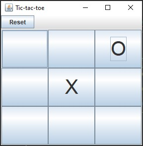

# Tic-tac-toe
The goal of this project was to develop a software version of the Tic-tac-toe game. This is currently a GUI-based playable version of the game, i.e., the game is played via the GUI using the mouse, with a GUI-based view of the board after each move. There is a reset feature, which resets the board if the players wish to.

## Usage
These instructions will get you a copy of the project running on your local machine for development and testing purposes.

### Getting started
To get the game started, run the StartGame class as a Java Application. Or, run the Tic-tac-toe.jar file. You will be greeted with an empty grid.



### Interacting with the game

User input is processed via mouse. To place your peice, simply click on an empty grid square. 

The intital player is "X". Once "X" has placed their piece on the board, it becomes "O"'s turn. The player turns switch automatically.



### Reset

Once a player has one the game, or the game is a draw; the board can be reset for another game. Simply click the reset button on the top left menu bar, and the board will be cleared. Again, the first player will be "X".

### Class description

```
- TicTacToeView: Creates the GUI components and acts as the view for the game
- TicTacToeController: Contains all the user interaction code through mouse presses
- TicTacToeEvent: The abstract class for game events that extends EventObject
- TicTacToeModel: The game model that creates a grid and makes moves
- TicTacToelListener: Interface implemented by TicTacToeModel for handling piece placement
- GameStatus: The enum for the current status of the game
- StartGame: The entry point into the game
```

## Built With

* [Eclipse](https://www.eclipse.org/downloads/) - The integrated development environment used
* [JUnit](https://junit.org/junit5/) - Testing Framework
* [Git](https://git-scm.com/) - Used for version control
